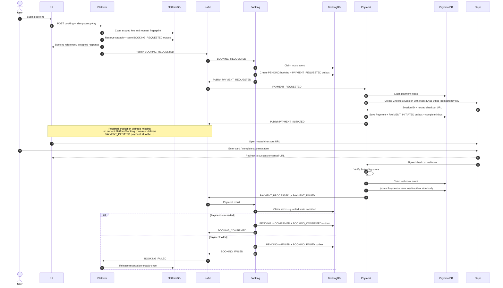

# Complete Booking and Payment Flow

## Purpose

This document describes the current end-to-end flow across the Platform, Booking,
Payment, Stripe, and UI boundaries. It distinguishes code that exists today from
integration work still required before production.

## Service ownership

| Capability | Owner | Primary implementation |
|---|---|---|
| HTTP booking command and request idempotency | Platform | `BookingControllerAdmin`, `BookingOrchestrationService`, `BookingRequestIdempotencyCoordinator` |
| Capacity reservation and release | Platform | `BookingCreationTransactionService`, `SlotInventoryService`, `BookingReservationService` |
| Booking lifecycle | Booking | `BookingRequestProcessor`, `PaymentProcessedProcessor`, `PaymentFailedProcessor` |
| Payment session and financial state | Payment | `PaymentProcessService`, `PaymentTransactionService`, `StripePaymentProcessor`, `WebhookProcessingService` |
| Card entry and payment authentication | Stripe-hosted Checkout UI | Stripe Checkout Session |
| Reliable inter-service delivery | Each producing service | Transactional outbox plus publisher/retry jobs |
| Duplicate Kafka delivery control | Each consuming service | Durable inbox keyed by producer and event ID |

## Architecture pattern alignment

Payment now follows the same **kind** of reliability pattern as Booking:

1. A Kafka consumer delegates to a service rather than executing domain writes in
   the listener.
2. The inbound event is durably claimed before Kafka acknowledgement.
3. Domain state, outgoing event, and inbound completion are committed together.
4. Outgoing events are stored before publication.
5. Publication is attempted immediately and recovered by Quartz if it fails.
6. Retry jobs are non-concurrent and dead records are made visible.

The class names are different because Payment has one inbound command and an
external provider boundary, while Booking has a processor registry for several
inbound event types.

| Booking pattern | Payment equivalent |
|---|---|
| `InboundEventProcessorService` | `PaymentProcessService` |
| `InboundOutboxService` | `PaymentOutboxService` |
| `InboundEventProcessingTransactionService` | `PaymentTransactionService` |
| `OutgoingOutboxService` | `OutgoingPaymentOutboxService` |
| `OutgoingOutboxPublisher` | `OutgoingPaymentPublisher` |
| `InboundOutboxRetryService` | `PaymentIncomingRetryService` |
| `OutboxDeadLetterHandler` | `PaymentDeadLetterHandler` |

## End-to-end sequence

## Detailed processing stages

### 1. Platform accepts the HTTP command

- `BookingControllerAdmin` requires `Idempotency-Key`.
- `BookingRequestFingerprintService` fingerprints the normalized request.
- `BookingRequestIdempotencyCoordinator.claimOrReplay` scopes the key by operation
  and caller, rejects payload conflicts, replays completed responses, and leases
  in-progress requests.
- `BookingCreationTransactionService` reserves slot inventory, creates a
  `BookingReservation`, writes the Platform outbox, and completes the idempotency
  record in one local transaction.
- `SlotInventory` and `BookingReservation` use JPA `@Version`.

### 2. Booking creates the booking aggregate

- `BookingRequestConsumer` receives `BOOKING_REQUESTED`.
- `InboundEventProcessorService` creates or loads the durable inbox row before
  acknowledging Kafka.
- `InboundEventProcessingTransactionService` invokes `BookingRequestProcessor`.
- The transaction creates a `PENDING` `Booking`, writes `PAYMENT_REQUESTED`, and
  completes the inbox row.
- `OutgoingOutboxPublisher` waits for Kafka send completion before marking the
  outgoing row sent.

### 3. Payment creates the Stripe session

- `PaymentRequestConsumer` delegates to `PaymentProcessService`.
- `PaymentOutboxService.findOrCreateForEvent` deduplicates by
  `(producer, event_id)`. Concurrent insertion recovery occurs outside the failed
  insert transaction.
- `StripePaymentProcessor` creates a real Stripe Checkout Session. The inbound
  event ID is passed as Stripe's idempotency key so a retry cannot create another
  provider session for the same payment command.
- `PaymentTransactionService` atomically persists:
  - the `Payment`;
  - the `PAYMENT_INITIATED` outgoing row;
  - the inbound row's `PROCESSED` state.
- `OutgoingPaymentPublisher` marks the row `SENT` only after the Kafka future
  completes successfully.

### 4. Stripe resolves payment asynchronously

- The browser redirect is only user experience. It is not proof of payment.
- `StripeWebhookController` verifies `Stripe-Signature`.
- A successful Checkout event is accepted as success only when
  `session.payment_status == paid`.
- `WebhookProcessingService` uses Stripe's immutable webhook event ID as its inbox
  key, updates the `Payment`, stores the Stripe PaymentIntent ID for reconciliation,
  and writes the result event in one transaction.
- `WebhookProcessingService` acquires a database write lock on the Payment row.
  Competing terminal webhooks therefore serialize; the later transaction observes
  the already-terminal state and performs no second effect.

### 5. Booking applies the result

- `PAYMENT_PROCESSED` transitions a `PENDING` booking to `CONFIRMED`.
- `PAYMENT_FAILED` transitions it to `FAILED` and emits `BOOKING_FAILED`.
- Platform consumes `BOOKING_FAILED` and `BookingReservationService.releaseOnce`
  releases capacity once.

## Current event contract

| Event | Producer | Consumer | Important payload |
|---|---|---|---|
| `BOOKING_REQUESTED` | Platform | Booking | booking reference and reserved snapshot |
| `PAYMENT_REQUESTED` | Booking | Payment | booking ID, amount, currency, customer and experience snapshot |
| `PAYMENT_INITIATED` | Payment | **No ecosystem consumer currently implemented** | provider session ID and checkout URL |
| `PAYMENT_PROCESSED` | Payment | Booking | booking ID, transaction ID, `amountPaid`, currency, `paidAt` |
| `PAYMENT_FAILED` | Payment | Booking | booking ID, reason, error code, `failedAt` |
| `BOOKING_FAILED` | Booking | Platform | booking/reservation identity for compensation |

The checked-in topic contract now aligns Payment success publication with Booking:

- Payment property `kafka.topics.payment-processed` resolves to
  `topic_payment_confirmed`;
- Booking listens to `kafka.topics.payment-confirmed`;
- Payment's producer type mapping emits the compatibility type IDs expected by
  Booking's `BookingKafkaConfig`.

## Enterprise and production-readiness assessment

### What is enterprise-grade now

- Database-enforced Kafka deduplication.
- Transactional outbox boundaries for local state and event creation.
- Optimistic locking on mutable inbox/outbox and inventory state.
- Confirmed Kafka publication rather than fire-and-forget success.
- Stripe webhook authentication and Stripe API idempotency.
- Durable retries, dead states, cleanup jobs, and non-overlapping Quartz jobs.
- A real Spring context test and database-backed processing-flow test.

### Production gates still open

The service is **architecturally strong but not production-ready until these gates
are closed**:

1. **UI checkout handoff:** add a durable consumer/read model or authenticated API
   that returns the `PAYMENT_INITIATED.paymentUrl` to the correct user.
2. **Versioned migrations:** replace `ddl-auto: update`; provision Payment and Quartz
   tables with Flyway/Liquibase. The safe default uses the in-memory Quartz store;
   production must provision the Quartz schema before setting
   `QUARTZ_JOB_STORE_TYPE=jdbc`.
3. **Secrets:** remove the default PostgreSQL password from source and source all
   database, Stripe, Kafka, and Consul credentials from a secret manager.
4. **Authorization:** secure `PaymentAdminController`; it currently exposes payment
   and outbox data without an in-service authorization rule.
5. **Real alert transport:** `AlertService` currently logs only. Wire PagerDuty,
   Slack, or the enterprise incident platform.
6. **Bounded/atomic retry claiming:** retry queries should page rows and use
   database claims suitable for multiple application replicas.
7. **Provider reconciliation:** add a scheduled query against Stripe for payments
   stuck in `PENDING` when a webhook is delayed or permanently lost.
8. **Cross-service contract tests:** run Platform, Booking, Payment, PostgreSQL, and
   Kafka together in CI and validate JSON compatibility.
9. **Production observability:** add metrics for inbox age, retry counts, dead rows,
   webhook failures, provider latency, and payment-result latency.

## Verification baseline

The Payment repository's `mvnw.cmd clean verify` runs four tests, including:

- Spring application context and transactional-proxy verification;
- H2-backed inbox → payment → outgoing-outbox processing;
- initiated-event serialization and identity;
- default provider routing when Booking omits `paymentType`.

Payment-generated events now follow Booking's durable envelope convention: a new
producer-owned `eventId`, `producer=payment-service`, the unchanged
`correlationId`, `causationId` set to the direct inbound event, schema version, and
occurrence timestamp.

External correctness still requires integration testing with PostgreSQL, Kafka,
Stripe test mode, and the UI/BFF handoff.
