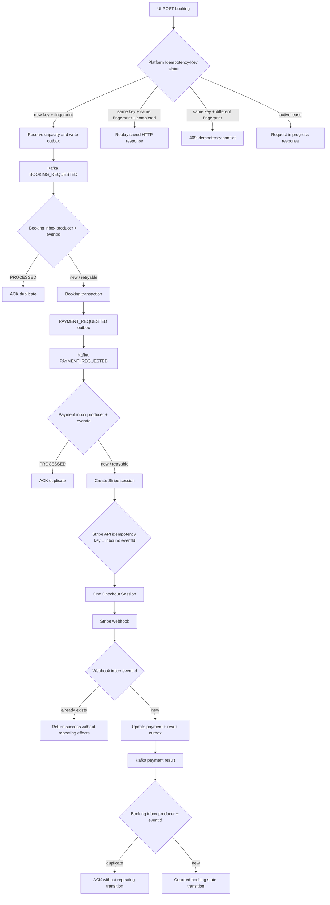
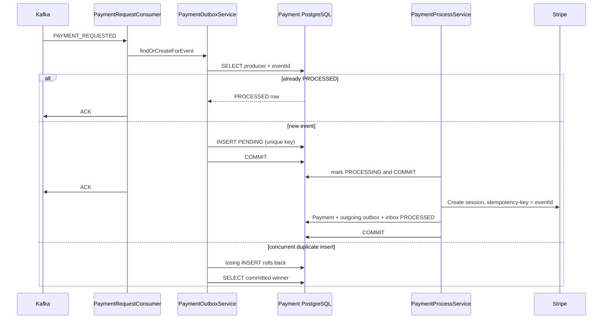
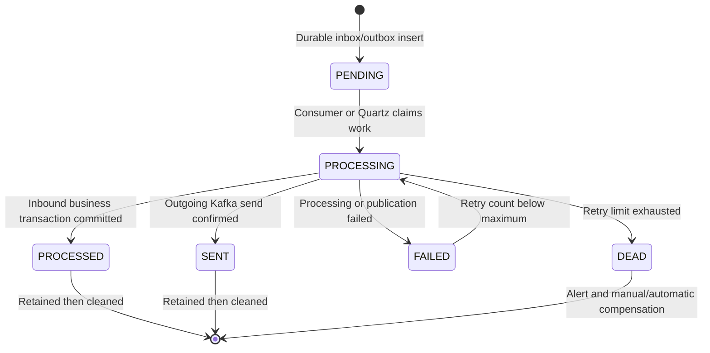

# Duplicate Checks and Idempotency Controls

## Purpose

This document explains where duplicates can occur, which identity controls each
boundary, and what effect is guaranteed. The system provides **effectively-once
local business effects**, not globally exactly-once delivery.

## Identity types

| Identity | Scope | Owner | Purpose |
|---|---|---|---|
| `Idempotency-Key` | One HTTP booking operation and caller | UI/Platform | Prevent duplicate booking commands |
| Request fingerprint | Canonical HTTP payload | Platform | Reject the same key with a different request |
| `(producer, eventId)` | One logical Kafka event | Event producer | Deduplicate Kafka delivery and producer retries |
| Stripe API idempotency key | One Stripe session creation command | Payment | Prevent duplicate Checkout Sessions |
| Stripe webhook `event.id` | One provider notification | Stripe | Prevent duplicate webhook effects |
| JPA `version` | One mutable row | Owning service | Detect concurrent stale updates |

Never substitute a booking ID for event identity. One booking legitimately receives
several events.

## End-to-end duplicate-control flow

## 1. Duplicate HTTP booking requests

### Implementation

Platform owns command idempotency:

- `BookingControllerAdmin` requires `Idempotency-Key`.
- `BookingRequestFingerprintService` creates a deterministic payload fingerprint.
- `BookingRequestIdempotencyCoordinator` hashes the raw key, scopes it by caller
  and operation, and creates a five-minute owner lease.
- The database unique key permits one owner.
- A completed matching request returns the stored booking response.
- A mismatched fingerprint raises `IdempotencyConflictException`.
- An active owner raises `IdempotencyRequestInProgressException`.
- A failed or expired owner can be reclaimed safely.

### Result

Repeated button clicks, client timeouts, gateway retries, and mobile network retries
do not reserve capacity twice when they reuse the same key and payload.

## 2. Duplicate Kafka events in Booking

Booking's `InboundOutbox` contains:

- unique `(producer, event_id)` for one logical event;
- `(booking_ref_id, event_type)` as an aggregate-level guard;
- payload, status, retry count, and timestamps for recovery.

`InboundEventProcessorService` persists the inbox row before early Kafka
acknowledgement. If the row is already `PROCESSED`, the duplicate is acknowledged
without invoking the processor. Otherwise, the local transaction applies the
booking effect, writes the outgoing event, and completes the inbox.

## 3. Duplicate Kafka events in Payment

Payment uses `PaymentOutbox` as its inbound inbox despite the historical name.

- The database unique constraint is `(producer, event_id)`.
- `PaymentOutboxService.findOrCreateForEvent` checks for an existing record.
- A concurrent insert occurs in a separate transaction; after the losing insert
  rolls back, Payment loads the winner in a clean transaction.
- A `PROCESSED` row is acknowledged without creating another provider session.
- `PENDING`, `PROCESSING`, and `FAILED` rows remain recoverable by Quartz.

## 4. Duplicate Stripe API requests

`StripePaymentProcessor` sends the inbound `PAYMENT_REQUESTED.eventId` as the
Stripe request idempotency key.

This covers the critical gap between the external call and the local database
transaction. If Payment calls Stripe successfully and crashes before persisting the
session, the retry uses the same Stripe key and receives the same logical result
instead of creating a second Checkout Session.

## 5. Duplicate Stripe webhooks

Stripe retries webhooks until it receives a successful response.

`WebhookProcessingService` records `Stripe Event.id` in `webhook_inbox`, where
`event_id` is unique. The inbox insert, Payment state update, and outgoing result
event are part of one transaction.

If the same webhook arrives again:

- an already committed event performs no second payment transition;
- a concurrent duplicate loses the unique-key race;
- a transient non-2xx response allows Stripe to retry.

## 6. Duplicate outgoing publication

Kafka delivery remains at-least-once. The outbox row is the durable publication
intent:

1. The domain transaction inserts one outgoing row with a producer-owned event ID.
2. `OutgoingPaymentPublisher` sends the stored payload.
3. It waits for the `KafkaTemplate.send` future.
4. It marks the row `SENT` only after broker confirmation.
5. A failure marks it `FAILED`; Quartz retries the same row and event ID.
6. Downstream inboxes suppress repeated delivery.

## 7. Concurrency controls

### Optimistic locking

- Platform: `SlotInventory` and `BookingReservation`.
- Booking: `Booking` aggregate and reliability records.
- Payment: `PaymentOutbox` and `OutgoingPaymentOutbox`.

Payment terminal webhook transitions use a pessimistic database write lock rather
than an entity version. This serializes conflicting success/failure webhooks without
requiring a schema change to the existing `payment` table.

Payment state-transition methods return the refreshed entity after `saveAndFlush`.
This is necessary because a detached entity with an old `@Version` fails on the next
transaction.

### Scheduler overlap

`PaymentIncomingRetryJob`, `PaymentOutgoingRetryJob`, and
`OutboxOutgoingCleanupJob` use Quartz `@DisallowConcurrentExecution`.

This prevents overlap for one scheduler. A production multi-replica deployment
must additionally use shared clustered Quartz tables and database-level row claims.

## Failure and retry state machines

## Scenario matrix

| Scenario | Guard | Expected result |
|---|---|---|
| User double-clicks Book | Platform `Idempotency-Key` | One reservation and one response |
| Same HTTP key, different payload | Fingerprint comparison | Conflict; no second booking |
| Kafka redelivers `PAYMENT_REQUESTED` | Payment `(producer,eventId)` inbox | No second local business effect |
| Payment crashes after Stripe accepts request | Stripe idempotency key | Same Checkout Session on retry |
| Stripe sends webhook repeatedly | `webhook_inbox.event_id` | One Payment state transition |
| Success and failure webhooks race | Payment row write lock plus terminal-state guard | One terminal commit; later request is a no-op |
| Kafka send future fails | Outbox remains `FAILED` | Quartz republishes |
| Kafka accepted event but app missed response | Same outbox event ID | Downstream inbox discards duplicate |
| Two workers update one inbox row | JPA `@Version` | One winner; stale writer fails |
| Payment result arrives twice in Booking | Booking inbox and guarded transition | Booking transitions once |

## Remaining production gaps

1. Retry queries are unbounded lists and do not implement database
   `SKIP LOCKED`/lease claims for multiple Payment replicas.
2. Versioned database migrations are not present.
3. Cross-service schema compatibility is not enforced by a schema registry or
   consumer-driven contract test.
4. `AlertService` must send to a real incident system.
5. Stripe reconciliation and a longer financial idempotency/audit retention policy
   are still required.

## Operational invariants

- Never generate a new event ID when retrying an existing outbox row.
- Never mark an outgoing row `SENT` before Kafka confirms delivery.
- Never trust a browser success redirect as financial success.
- Never process a Stripe webhook without signature verification.
- Never use `bookingId` alone as Kafka event identity.
- Never acknowledge a Kafka record before durable local ownership exists.
