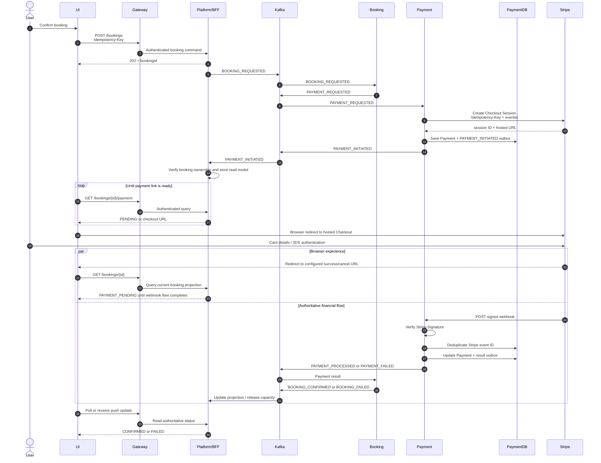
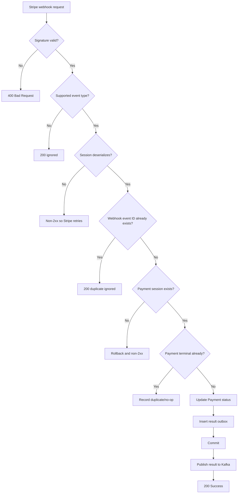

# Payment Webhook and UI Flow

## Purpose

This document explains how the browser, Stripe Checkout, Payment webhook, Kafka,
Booking, and Platform interact. It also identifies the UI handoff that must be
implemented before production.

## Core rule

> The UI redirect is presentation state. The verified Stripe webhook is financial
> state.

The UI must never confirm a booking solely because the browser reached a success
URL. Browsers can close, redirects can be replayed, and URLs can be opened manually.

## Current implemented backend flow

1. Booking publishes `PAYMENT_REQUESTED`.
2. Payment creates a Stripe Checkout Session.
3. Payment persists a `PAYMENT_INITIATED` event containing `paymentUrl` and
   `providerSessionId`.
4. Payment publishes that event.
5. Stripe hosts the card-entry and authentication UI.
6. Stripe sends a signed webhook to Payment.
7. Payment verifies the signature, applies the provider state, and publishes
   `PAYMENT_PROCESSED` or `PAYMENT_FAILED`.
8. Booking consumes the result and changes booking state.

## Missing UI handoff

Neither the current Platform nor Booking repository consumes
`PAYMENT_INITIATED`, and Payment exposes no customer-facing endpoint that returns
the checkout URL. Therefore the backend can create and publish the Stripe session,
but the current ecosystem does not deliver that URL to the browser.

Before production, implement one of these patterns:

### Recommended: authenticated payment read model

1. A Platform/BFF consumer receives `PAYMENT_INITIATED`.
2. It stores a short-lived mapping of authenticated user + booking ID + payment URL.
3. The UI polls or subscribes to `GET /bookings/{bookingId}/payment`.
4. The BFF verifies booking ownership and returns the Stripe URL.
5. The UI redirects the browser to Stripe.

This keeps Payment internal, prevents exposing the Kafka topology to the UI, and
centralizes authorization.

### Alternative: Payment API

Payment can expose an authenticated, ownership-checked endpoint that returns the
latest Checkout Session for a booking. This requires service-to-service identity or
trusted user claims and must not expose the current admin endpoint.

## Recommended production sequence



## Payment webhook processing

### Endpoint

With the configured context path, Stripe calls:

```text
POST /payment/api/webhooks/stripe
Stripe-Signature: <Stripe signature>
```

The webhook endpoint must be publicly reachable through the ingress while remaining
separate from customer/admin authorization paths.

### Signature verification

`StripeWebhookController`:

1. Requires the `Stripe-Signature` header.
2. Requires `PAYMENT_GATEWAY_WEBHOOK_SECRET`.
3. calls `Webhook.constructEvent(payload, signature, secret)`;
4. rejects invalid signatures;
5. rejects events whose Checkout Session cannot be deserialized.

Never add a production fallback that directly parses unverified JSON.

### Event mapping

| Stripe event | Validation | Payment result |
|---|---|---|
| `checkout.session.completed` | `payment_status == paid` | `SUCCESS` |
| `checkout.session.async_payment_succeeded` | `payment_status == paid` | `SUCCESS` |
| `checkout.session.expired` | Valid signed session | `FAILED` |
| `checkout.session.async_payment_failed` | Valid signed session | `FAILED` |
| Other event types | Logged and acknowledged | No state change |

### Atomic database work

`WebhookProcessingService.processWebhookAtomically` commits together:

- `webhook_inbox` insert keyed by Stripe event ID;
- Payment status update;
- Stripe PaymentIntent ID as `transactionId`;
- `PAYMENT_PROCESSED` or `PAYMENT_FAILED` outgoing outbox insert.

If any write fails, the transaction rolls back and Stripe receives a non-success
response, allowing retry.



## UI state model

The UI should display these states independently from browser location:

| UI state | Source of truth | UX |
|---|---|---|
| `CREATING_PAYMENT` | No initiated read model yet | Spinner; do not create another booking |
| `AWAITING_PAYMENT` | Checkout URL available | Redirect/continue-to-payment button |
| `PAYMENT_PENDING` | Browser returned but no verified result | “Confirming payment” and poll |
| `CONFIRMED` | Booking/Platform projection after processed event | Confirmation page |
| `FAILED` | Booking/Platform projection after failed event | Failure reason and safe retry path |
| `TIMED_OUT` | Reconciliation policy | Explain expiration and release inventory |

The UI must reuse the original booking `Idempotency-Key` for HTTP retries and must
not create a new booking merely because checkout status is temporarily unknown.

## Security requirements

1. Store Stripe secrets in a secret manager, not source or plain environment files.
2. Use HTTPS from Stripe to ingress.
3. Preserve the exact raw request body used for signature verification.
4. Rate-limit the webhook endpoint without blocking legitimate Stripe retries.
5. Authenticate every customer-facing payment-status/payment-link endpoint.
6. Verify that the authenticated user owns the booking.
7. Never log card data, signatures, secrets, or raw sensitive webhook payloads.
8. Restrict admin endpoints separately from the public webhook.

## Failure behavior

| Failure | Expected behavior |
|---|---|
| User closes Stripe page | Booking remains pending until expiration/reconciliation |
| Success redirect lost | Webhook still confirms payment |
| Webhook delayed | UI shows `PAYMENT_PENDING` and polls authoritative state |
| Duplicate webhook | Webhook inbox suppresses repeated effects |
| Payment service restarts after Stripe session creation | Stripe idempotency key returns the same logical session |
| Kafka unavailable after webhook commit | Result remains in outgoing outbox and Quartz retries |
| Booking unavailable | Kafka retains/result redelivers; Booking inbox handles duplicates |
| Unknown provider session | Payment rolls back and returns non-2xx for investigation/retry |

## Production checklist

- [ ] Add a consumer/read model for `PAYMENT_INITIATED`.
- [ ] Add an authenticated UI endpoint or push channel for the payment URL.
- [ ] Configure Stripe success/cancel URLs for the real UI domain.
- [ ] Configure the public webhook URL in Stripe.
- [ ] Store and rotate Stripe API and webhook secrets.
- [ ] Add webhook signature, duplicate, unknown-session, async-result, and replay tests.
- [ ] Add a pending-payment expiration/reconciliation policy shared with Booking.
- [ ] Add dashboards and alerts for webhook failures and webhook-to-booking latency.
