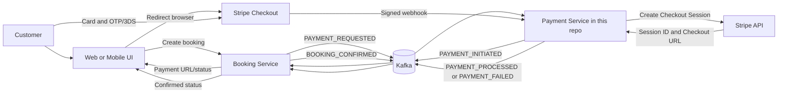
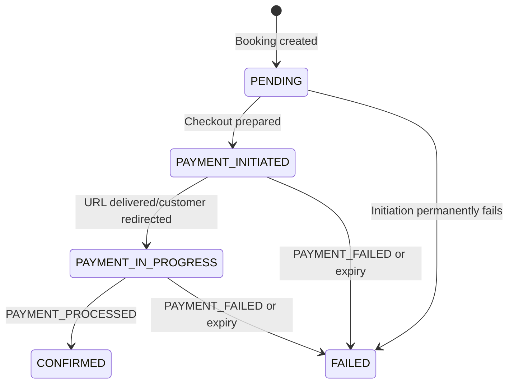
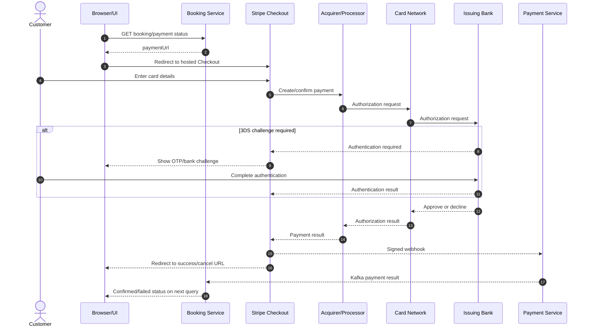
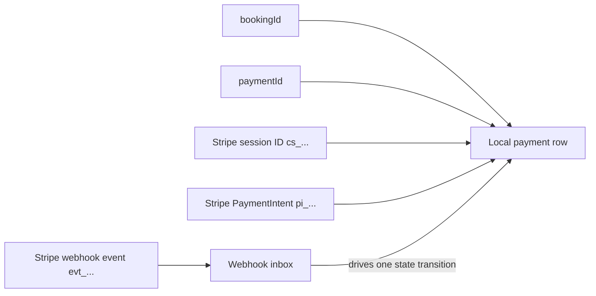
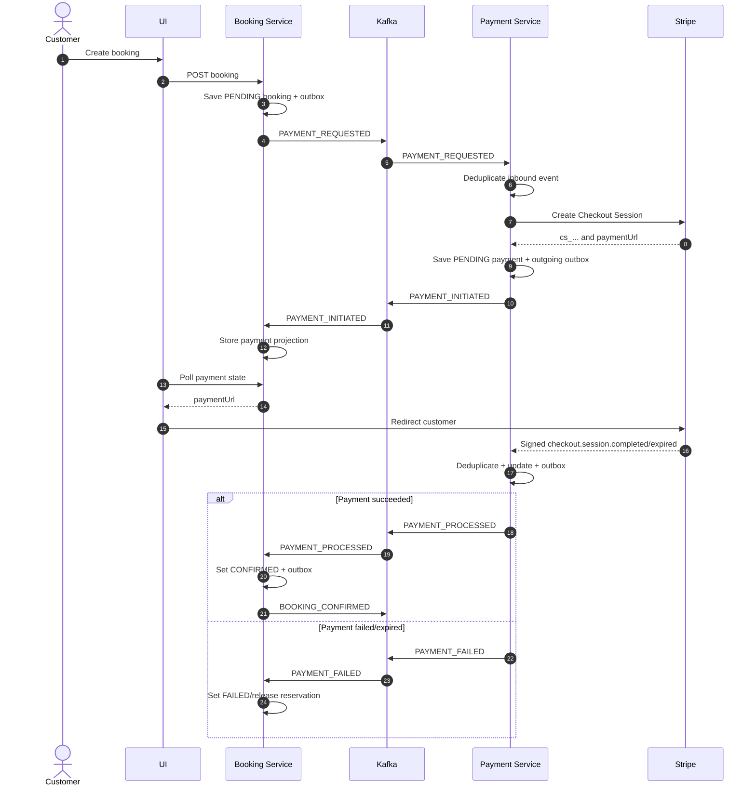

# Booking-to-Payment Event-Driven Flow

This guide explains how a booking moves through an event-driven payment flow:

**Booking Service -> Kafka -> Payment Service -> Stripe Checkout -> signed Stripe webhook -> Kafka -> Booking confirmation**

It is written for a junior Java developer who is new to payment gateways, Stripe, Kafka, event-driven architecture, and microservices.

> [!IMPORTANT]
> This repository contains only the Spring Boot **Payment Service**. It does not contain the Booking Service or a frontend. Sections describing those components are therefore a recommended design, not a description of code that exists here.

### Repository truth versus recommended production design

The code is the source of truth because the repository `README.md` contains only the project name.

| Area | Verified in this repository | Recommended production behavior |
|---|---|---|
| Runtime | Java 17, Spring Boot 3.1.5, Spring Kafka, Spring Data JPA, PostgreSQL, Quartz, Stripe Java 24.2.0 | Keep supported versions patched and manage schema changes with migrations |
| Inbound event | `PaymentRequestedEvent` consumed from `topic_payment_requested` | Booking Service publishes it through its own transactional outbox |
| Payment initiation | Builds Stripe `SessionCreateParams` | Call `Session.create(...)` with a Stripe idempotency key |
| Stripe result | Currently generates a mock `cs_test_<uuid>` and mock URL; the real API call is commented out | Persist the real Checkout Session ID and hosted Checkout URL |
| Initiated event | `PAYMENT_INITIATED` with booking ID, URL, provider session ID, and provider | Also include a stable payment ID, event ID, producer, amount, currency, and schema version |
| Initiated topic | Falls back to `payment-initiated-topic` because no YAML value is defined | Define `kafka.topics.payment-initiated` explicitly in every environment |
| Webhook endpoint | `POST /payment/api/webhooks/stripe` | Expose this endpoint through HTTPS and restrict operational access appropriately |
| Webhook signature | Verification code is present but commented out; raw JSON is parsed | Always use `Webhook.constructEvent(payload, signature, secret)` |
| Webhook events | Handles `checkout.session.completed` and `checkout.session.expired` | Also decide how to handle asynchronous payment methods and delayed failures |
| Payment completion | Correlates by `provider_session_id`, changes status, writes an outgoing outbox row | Verify payment status, amount, currency, and provider object before confirming |
| Completion event | `PAYMENT_PROCESSED` on `topic_payment_processed`; failure on `topic_payment_failed` | Booking Service consumes idempotently and publishes `BOOKING_CONFIRMED` from its own outbox |
| Booking/UI | Not present | Implement the responsibilities described below in their owning services |

Other current-code caveats are called out where they matter. In particular:

- `PaymentInitiatedEvent#getEventId()` and `getProducer()` currently throw `UnsupportedOperationException`.
- The payment table has no uniqueness constraints on `provider_session_id` or `transaction_id`.
- `PaymentAdminController` references a repository method that is not declared.
- `PaymentIncomingRetryService` imports a missing `PaymentResult` type.
- The webhook code stores the Stripe webhook event ID as `transactionId`; in production, a Stripe PaymentIntent or Charge ID is normally the provider transaction reference.

These are observations, not changes made by this document.

---

## 1. Big Picture Overview

### The story in simple language

1. A customer chooses an experience in the UI and clicks **Book and pay**.
2. The UI calls the Booking Service. The Booking Service creates a booking, normally in `PENDING` status.
3. The Booking Service publishes a `PAYMENT_REQUESTED` event to Kafka. Kafka stores the event durably and delivers it to interested consumers.
4. This Payment Service consumes that event from `topic_payment_requested`.
5. The Payment Service creates a local payment record and asks Stripe to create a Checkout Session.
6. Stripe returns:
   - a provider-owned Checkout Session ID such as `cs_test_...`; and
   - a Stripe-hosted payment URL.
7. The Payment Service saves those values and publishes `PAYMENT_INITIATED`.
8. The Booking Service consumes `PAYMENT_INITIATED`, stores the payment details it needs, and exposes the payment URL to the UI.
9. The UI redirects the customer's browser to Stripe Checkout.
10. Stripe collects card details and, when required, performs OTP/3-D Secure authentication. Stripe communicates with the acquiring bank, card network, and issuing bank.
11. Stripe sends a server-to-server webhook to the Payment Service. A production endpoint must verify the `Stripe-Signature` header before trusting the body.
12. The Payment Service correlates the webhook's Checkout Session ID with its payment record, updates the payment, and publishes `PAYMENT_PROCESSED` or `PAYMENT_FAILED`.
13. The Booking Service consumes that final payment fact. On success it marks the booking `CONFIRMED` and may publish `BOOKING_CONFIRMED`.
14. The UI polls or subscribes to booking status and shows the confirmed or failed state. The redirect page is informative only; it is not proof of payment.

### System diagram



### Which interactions are synchronous?

- UI -> Booking Service is normally HTTP.
- Payment Service -> Stripe to create a Checkout Session is HTTPS.
- Browser -> Stripe Checkout is HTTPS.
- Stripe -> Payment Service webhook is HTTPS.

The caller waits for a response during each synchronous interaction.

### Which interactions are asynchronous?

- Booking Service -> Kafka -> Payment Service.
- Payment Service -> Kafka -> Booking Service.
- Booking Service -> Kafka for `BOOKING_CONFIRMED`.

The publisher does not wait for the consumer to finish its business operation. This decouples services and permits retries, but it creates eventual consistency: the booking may remain pending for a short time while events move through the system.

### What this repository actually owns

This Payment Service:

- listens with `PaymentRequestConsumer`;
- records inbound event processing in `payment_outbox`;
- coordinates payment creation in `PaymentProcessService`;
- implements a Stripe strategy in `StripePaymentProcessor`;
- persists `Payment`;
- records outgoing events in `outgoing_payment_outbox`;
- publishes with `PaymentEventProducer`;
- receives Stripe webhooks in `StripeWebhookController`;
- deduplicates webhook IDs in `webhook_inbox`; and
- retries inbox/outbox work using Quartz jobs.

It does not implement booking creation, booking confirmation, `BOOKING_CONFIRMED`, UI redirects, or UI status updates.

---

## 2. Why Stripe Session Exists

### What a Checkout Session is

A Stripe Checkout Session is a short-lived, Stripe-owned description of one checkout attempt. It tells Stripe:

- what is being sold;
- how much to collect;
- which currency to use;
- whether this is a one-time payment or subscription;
- where to redirect after success or cancellation;
- optional customer and business metadata; and
- which Stripe payment objects belong to this checkout.

Stripe creates and owns the session. Its ID looks like:

```text
cs_test_a1B2C3...
```

The current code builds a one-time `PAYMENT` session with one line item, a product name such as `Booking BK-2026-00042`, the booking ID as `client_reference_id`, and success/cancel URLs.

### Why `bookingId` or `paymentId` cannot replace it

Identifiers have different owners and purposes:

| Identifier | Owner | Purpose |
|---|---|---|
| `bookingId` | Booking Service | Identifies the reservation/business order |
| `paymentId` | Payment Service | Identifies the local payment attempt |
| `cs_...` Checkout Session ID | Stripe | Identifies the Stripe-hosted checkout attempt |
| `pi_...` PaymentIntent ID | Stripe | Identifies Stripe's payment lifecycle |
| `evt_...` webhook event ID | Stripe | Identifies one webhook delivery event |

Stripe cannot retrieve a Checkout Session using an arbitrary local booking ID unless the local application first maps that ID to Stripe's session ID. Likewise, a Stripe webhook naturally contains Stripe identifiers, not a database primary key from this application.

### Analogy

Think of a hotel and a courier:

- `bookingId` is the hotel's reservation number.
- `paymentId` is the hotel's finance-department case number.
- `sessionId` is the courier's tracking number.

The hotel may print its reservation number on the parcel, but the courier still needs its own tracking number to route and report on the parcel. The application keeps the mapping between the two worlds.

### Useful session data

A real Stripe Checkout Session can expose or reference:

- `id`: `cs_...`;
- `url`: hosted Checkout URL;
- `status`: `open`, `complete`, or `expired`;
- `payment_status`: for example `paid`, `unpaid`, or `no_payment_required`;
- `client_reference_id`: this code sets it to `bookingId`;
- `payment_intent`: the related `pi_...`;
- `amount_total` and `currency`;
- customer/customer-email information;
- metadata added by the application;
- expiration time; and
- success/cancel URLs.

Recommended metadata:

```java
SessionCreateParams params = SessionCreateParams.builder()
    .setMode(SessionCreateParams.Mode.PAYMENT)
    .setClientReferenceId(bookingId)
    .putMetadata("bookingId", bookingId)
    .putMetadata("paymentId", paymentId.toString())
    .setSuccessUrl(frontendBaseUrl + "/payment/success?session_id={CHECKOUT_SESSION_ID}")
    .setCancelUrl(frontendBaseUrl + "/payment/cancel")
    .addLineItem(lineItem)
    .build();
```

Metadata helps investigation, but the database mapping remains authoritative.

---

## 3. After `PAYMENT_REQUESTED`

### Exact consumed payload in this repository

`PaymentRequestedEvent` contains:

| Field | Java type | Meaning |
|---|---|---|
| `eventType` | `String` | Defaults to `PAYMENT_REQUESTED` |
| `bookingId` | `String` | Booking correlation ID |
| `userId` | `Long` | Customer ID |
| `userEmail` | `String` | Customer email |
| `experienceId` | `String` | Booked experience |
| `experienceName` | `String` | Display name |
| `timeSlotMapperId` | `String` | Selected slot mapping |
| `guestCount` | `Integer` | Number of guests |
| `grandTotal` | `BigDecimal` | Amount in major currency units |
| `currency` | `String` | Currency such as `USD` |
| `requestedAt` | `LocalDateTime` | Request creation time |
| `paymentType` | `String` | Must resolve to a registered strategy; this repo supports `STRIPE` |
| `eventId` | `String` | Unique event ID |
| `producer` | `String` | Producer identity used with `eventId` for deduplication |

Realistic input:

```json
{
  "eventType": "PAYMENT_REQUESTED",
  "eventId": "evt-booking-4fd4aa98-80db-4d42-8778-c922e6b508cf",
  "producer": "booking-service",
  "bookingId": "BK-2026-00042",
  "userId": 8812,
  "userEmail": "alex@example.test",
  "experienceId": "EXP-SUNSET-CRUISE",
  "experienceName": "Sunset River Cruise",
  "timeSlotMapperId": "TS-2026-09-20-1800",
  "guestCount": 2,
  "grandTotal": 149.98,
  "currency": "USD",
  "requestedAt": "2026-09-06T06:55:00",
  "paymentType": "STRIPE"
}
```

### Exact code path

1. `PaymentRequestConsumer` consumes `${kafka.topics.payment-requested}`, configured as `topic_payment_requested`, using consumer group `payment-service-group`.
2. Kafka acknowledgment mode is `MANUAL_IMMEDIATE`.
3. `PaymentProcessService` calls `PaymentOutboxService.findOrCreateForEvent(...)`.
4. The unique `(producer, event_id)` constraint provides inbound deduplication.
5. An already `PROCESSED` event is acknowledged and ignored.
6. A new/retryable row is marked `PROCESSING`.
7. Kafka is acknowledged early because the database now owns retry responsibility.
8. The processor registry looks up the strategy by `paymentType`. The only implementation returns `STRIPE`.
9. `StripePaymentProcessor` creates a `Payment` with:
   - `provider = STRIPE`;
   - event `bookingId`;
   - status `PENDING`;
   - event `grandTotal` and `currency`.
10. It builds `SessionCreateParams`.
11. It returns `providerSessionId` and `paymentUrl`.
12. The transaction saves `Payment`, maps `PENDING` to `PAYMENT_INITIATED`, saves an outgoing outbox row, and marks the inbound row `PROCESSED`.
13. After the transaction, `OutgoingPaymentPublisher` attempts Kafka publication.

### Stripe request and result: intended versus current

The intended API call is:

```java
Session session = Session.create(params);
payment.setProviderSessionId(session.getId());
payment.setPaymentUrl(session.getUrl());
```

The current repository comments out `Session.create(params)` and instead generates:

```text
providerSessionId = cs_test_<random UUID>
paymentUrl        = https://checkout.stripe.com/pay/<same mock ID>
```

Therefore, the current URL is illustrative and is not a live Stripe-hosted checkout.

### Current `PAYMENT_INITIATED` payload

The factory populates this logical shape:

```json
{
  "eventType": "PAYMENT_INITIATED",
  "bookingId": "BK-2026-00042",
  "paymentUrl": "https://checkout.stripe.com/pay/cs_test_fake-example",
  "providerSessionId": "cs_test_fake-example",
  "provider": "STRIPE"
}
```

Current caveat: serialization may fail because the event implements `OutGoingEvent`, but its explicit `getEventId()` and `getProducer()` methods throw `UnsupportedOperationException`.

A recommended enriched event is:

```json
{
  "schemaVersion": 1,
  "eventType": "PAYMENT_INITIATED",
  "eventId": "a2183eb9-5282-48ef-badb-ddcb41767b65",
  "producer": "payment-service",
  "occurredAt": "2026-09-06T06:55:01Z",
  "bookingId": "BK-2026-00042",
  "paymentId": 10492,
  "paymentUrl": "https://checkout.stripe.com/c/pay/cs_test_fake-example",
  "providerSessionId": "cs_test_fake-example",
  "provider": "STRIPE",
  "amount": 149.98,
  "currency": "USD"
}
```

---

## 4. Why Payment Record Is Saved

The payment record is the durable bridge between the application's identifiers and Stripe's identifiers. A browser redirect or an in-memory Java object is not durable enough.

### Core values to persist

- `bookingId`: which booking this payment attempt belongs to;
- `paymentId`: the Payment Service's stable local identifier (`Payment.id` here);
- `sessionId`: Stripe's `providerSessionId`;
- `paymentUrl`: where the UI redirects the customer;
- `status`: `PENDING`, `SUCCESS`, or `FAILED` in this repository;
- amount and currency: what the application intended to charge;
- provider: `STRIPE`;
- provider transaction reference: ideally the PaymentIntent/Charge ID after completion;
- timestamps: audit and timeout handling.

### Why persistence must happen before publishing

Suppose Stripe creates `cs_test_123` and the Payment Service publishes its URL without saving the mapping. If the service crashes:

- the customer can still pay;
- Stripe can still send a webhook;
- the restarted service receives `cs_test_123`;
- but no database row maps it to a booking.

The result is money received with no safely confirmable booking.

The repository avoids that ordering problem by saving both the `Payment` and outgoing outbox record in one database transaction before attempting Kafka publication.

### Failure scenarios

| Failure | Without durable payment state | With durable payment state |
|---|---|---|
| Service crashes after Stripe responds | Session-to-booking mapping is lost | Session can still be correlated |
| Kafka temporarily unavailable | Initiated event may disappear | Outbox remains `PENDING`/`FAILED` for retry |
| Customer closes browser | UI never reports success | Webhook updates persisted payment |
| Stripe retries webhook | Payment may be processed repeatedly | Webhook event ID and terminal state prevent duplicate effects |
| Operations investigates later | Logs may have expired | Database provides an auditable lifecycle |
| Booking Service misses event temporarily | Booking remains stale forever | Kafka/outbox retries permit convergence |

### Webhook correlation

The current webhook extracts `session.getId()` and runs:

```java
paymentRepository.findByProviderSessionId(providerSessionId)
```

This is why `provider_session_id` must be saved and should be unique. It is the lookup key supplied by Stripe's callback.

---

## 5. Why `PAYMENT_INITIATED` Exists

### It is a business fact

`PAYMENT_INITIATED` means:

> The Payment Service successfully prepared a payment attempt and has a provider checkout reference that the customer can use.

It does **not** mean money was collected.

### Why not wait only for `PAYMENT_PROCESSED`?

The Booking Service and UI need information before payment can happen:

- the URL to open;
- the fact that payment setup succeeded;
- a provider session reference for support/correlation;
- a state that distinguishes "waiting for Payment Service" from "waiting for customer."

If only `PAYMENT_PROCESSED` existed, there would be no event carrying the Checkout URL, and a booking could not distinguish a lost request from an abandoned checkout.

### Recommended booking state progression



Meaning:

- `PENDING`: booking exists; payment request has not yet produced a checkout.
- `PAYMENT_INITIATED`: payment attempt and URL exist.
- `PAYMENT_IN_PROGRESS`: customer has been directed to payment, or the system otherwise knows checkout is underway.
- `CONFIRMED`: trusted backend payment processing says the required amount was paid.
- `FAILED`: payment initiation or completion failed/expired.

This repository only defines payment statuses `PENDING`, `SUCCESS`, and `FAILED`. The five-state model above belongs in the Booking Service and is not implemented here.

---

## 6. Booking Service Responsibilities

Because the Booking Service is absent from this repository, this section is a recommended contract.

### On `PAYMENT_INITIATED`

The Booking Service should:

1. Deduplicate by event ID.
2. Load the booking by `bookingId`.
3. Reject or quarantine an event for the wrong aggregate or an invalid state transition.
4. Store payment correlation information.
5. Move the booking from `PENDING` to `PAYMENT_INITIATED`.
6. Make the payment URL available to the UI through an authenticated booking-status endpoint.
7. Commit its data and consumer-inbox marker atomically.

Do not log the full URL unnecessarily. Treat it as customer-specific operational data even though card details are not embedded in it.

### What should the Booking Service store?

| Value | Recommendation | Reason |
|---|---|---|
| `paymentId` | Store | Stable Payment Service reference; best cross-service support key |
| `providerSessionId` | Store if useful, but do not make it the booking domain's primary identity | Helps support and reconciliation; provider-specific |
| `paymentUrl` | Store with expiry awareness or expose through a dedicated payment view | Needed for redirect; can become stale |
| Payment status | Store a local projection | Enables UI/status and booking transitions |
| Full Payment entity | Do not duplicate | Payment Service owns payment details |

The current `PAYMENT_INITIATED` event does not include `paymentId`, so a consumer can only store booking ID, URL, provider session ID, and provider unless the contract is enriched.

### Example booking table changes

Illustrative schema:

```sql
alter table booking
    add column payment_id bigint,
    add column payment_provider varchar(32),
    add column provider_session_id varchar(255),
    add column payment_url varchar(1000),
    add column payment_status varchar(32),
    add column payment_updated_at timestamptz;

create unique index uq_booking_payment_id
    on booking(payment_id)
    where payment_id is not null;

create index ix_booking_provider_session_id
    on booking(provider_session_id)
    where provider_session_id is not null;
```

Example change after `PAYMENT_INITIATED`:

```sql
update booking
set payment_id = 10492,
    payment_provider = 'STRIPE',
    provider_session_id = 'cs_test_fake-example',
    payment_url = 'https://checkout.stripe.com/c/pay/cs_test_fake-example',
    payment_status = 'PAYMENT_INITIATED',
    status = 'PAYMENT_INITIATED',
    payment_updated_at = current_timestamp
where booking_id = 'BK-2026-00042'
  and status = 'PENDING';
```

For stricter service boundaries, store these fields in a `booking_payment_projection` table rather than expanding `booking`.

### Example consumer

```java
@KafkaListener(topics = "${kafka.topics.payment-initiated}")
@Transactional
public void onPaymentInitiated(PaymentInitiatedEvent event) {
    if (eventInboxRepository.existsByEventId(event.eventId())) {
        return;
    }

    Booking booking = bookingRepository.findByBookingId(event.bookingId())
        .orElseThrow(() -> new IllegalArgumentException("Unknown booking"));

    booking.markPaymentInitiated(
        event.paymentId(),
        event.providerSessionId(),
        event.paymentUrl()
    );

    eventInboxRepository.save(EventInbox.processed(event.eventId()));
}
```

---

## 7. How Customer Pays

### Redirect and card entry

The UI receives or polls for the Checkout URL, then performs a browser redirect:

```javascript
window.location.assign(paymentUrl);
```

The hosted form belongs to Stripe. The customer enters card data on Stripe's domain, reducing the application's direct exposure to sensitive card data and PCI scope. The application should never receive or store raw card number, CVC, or OTP.

### Authorization, OTP/3DS, and capture

1. **Authentication** asks, "Is this really the cardholder?" 3-D Secure may show an OTP, bank-app approval, or biometric challenge.
2. **Authorization** asks the issuer, "May this merchant reserve this amount on this card?"
3. **Capture** asks to finalize movement of the authorized funds. Stripe Checkout in normal automatic-capture mode generally handles authorization and capture as part of the PaymentIntent flow.
4. **Settlement** is the later movement of funds through the network into the merchant's balance/bank arrangements.

Do not treat a browser success redirect as proof that all these backend steps reached the required state.

### Participants

- **Customer/browser**: starts checkout and completes authentication.
- **Stripe Checkout**: securely collects payment details and coordinates the payment.
- **Acquirer/payment processor**: handles the merchant side of card processing.
- **Card network**: Visa, Mastercard, and similar routing networks.
- **Issuer**: customer's bank; approves or declines.
- **Payment Service**: creates the session and trusts verified backend webhook facts.
- **Booking Service**: confirms the booking after the final payment event.

### Customer payment sequence



The webhook and browser redirect can arrive in either order. Design them as independent signals; only the verified webhook changes authoritative payment status.

---

## 8. Why Webhooks Exist

A webhook is an HTTP callback from Stripe's backend to the Payment Service's backend. It exists because payment completion is asynchronous and the customer browser is not reliable.

### Why the UI must never be trusted as payment proof

A browser can:

- close before redirect;
- lose network connectivity;
- reload or forge a success URL;
- be controlled by a malicious user;
- block scripts;
- time out while the payment later succeeds; or
- reach the success page before internal services process the webhook.

Therefore:

```text
Success page = user experience signal
Verified Stripe webhook = backend payment signal
```

The success page should say something like "We are confirming your payment" and query the Booking Service until it reports `CONFIRMED` or `FAILED`.

### Endpoint in this repository

With server context path `/payment` and controller mapping `/api/webhooks/stripe`, the endpoint is:

```text
POST /payment/api/webhooks/stripe
```

It handles:

- `checkout.session.completed` -> local `PaymentStatus.SUCCESS`;
- `checkout.session.expired` -> local `PaymentStatus.FAILED`.

### Signature verification

Stripe signs the exact raw request body. Production code must verify it before parsing or acting:

```java
@PostMapping
public ResponseEntity<Void> handle(
        @RequestBody String payload,
        @RequestHeader("Stripe-Signature") String signature) {
    Event event;
    try {
        event = Webhook.constructEvent(payload, signature, endpointSecret);
    } catch (SignatureVerificationException exception) {
        return ResponseEntity.badRequest().build();
    }

    webhookApplicationService.process(event);
    return ResponseEntity.ok().build();
}
```

Use the webhook signing secret (`whsec_...`), not the Stripe API secret key (`sk_...`). Keep both in a secret manager or environment-specific secure configuration.

> [!WARNING]
> The current controller does **not** enforce signatures. `Webhook.constructEvent(...)` is commented out, and the body is parsed directly. That is local-development behavior and must not be represented as a signed production flow.

---

## 9. `PAYMENT_PROCESSED` Flow

### Current repository flow

For `checkout.session.completed`:

1. Read Stripe's webhook event ID (`evt_...`).
2. Deserialize the Checkout Session.
3. Read `session.id` (`cs_...`).
4. Check whether `webhook_inbox.event_id` already exists.
5. Insert a `webhook_inbox` row.
6. Find `payment` by `provider_session_id`.
7. Reject an unknown session ID.
8. Ignore a payment already in terminal `SUCCESS` or `FAILED`.
9. Change status to `SUCCESS`.
10. Set current `transaction_id` to the webhook event ID.
11. Save the payment.
12. Create a `PAYMENT_PROCESSED` outgoing event and outbox row.
13. After the transaction, try to publish it to `topic_payment_processed`.

For `checkout.session.expired`, the same pattern changes status to `FAILED` and produces `PAYMENT_FAILED`.

### Correlation identifiers



Recommended meaning:

- `provider_session_id = cs_...`;
- `provider_reference` or `transaction_id = pi_...`/`ch_...`;
- `webhook_inbox.event_id = evt_...`.

The current implementation stores `evt_...` in `transaction_id`. Keep those concepts separate in production.

### Duplicate webhook behavior

Stripe retries webhooks when it does not receive a timely successful response. Duplicates are normal.

The repository uses two defenses:

- `webhook_inbox.event_id` is unique and checked first;
- a payment already in terminal `SUCCESS`/`FAILED` is not transitioned again.

The database unique constraint is the final race-condition defense. An `exists` check alone is not atomic when two requests arrive simultaneously.

### Recommended Spring Boot transaction

```java
@Transactional
public OutgoingEvent handleCheckoutCompleted(Event stripeEvent, Session session) {
    if (!"paid".equals(session.getPaymentStatus())) {
        throw new IllegalStateException("Checkout completed but is not paid");
    }

    if (webhookInboxRepository.existsByProviderAndEventId("STRIPE", stripeEvent.getId())) {
        return null;
    }

    Payment payment = paymentRepository
        .findByProviderAndProviderSessionId("STRIPE", session.getId())
        .orElseThrow(() -> new IllegalArgumentException("Unknown Stripe session"));

    long expectedMinorUnits = payment.getAmount()
        .movePointRight(2)
        .longValueExact();

    if (!Objects.equals(session.getAmountTotal(), expectedMinorUnits)
            || !payment.getCurrency().equalsIgnoreCase(session.getCurrency())) {
        throw new IllegalStateException("Webhook amount/currency mismatch");
    }

    webhookInboxRepository.save(
        WebhookInbox.processed("STRIPE", stripeEvent.getId())
    );

    if (payment.getStatus() == PaymentStatus.SUCCESS) {
        return null;
    }
    if (payment.getStatus() == PaymentStatus.FAILED) {
        throw new IllegalStateException("Illegal FAILED -> SUCCESS transition");
    }

    payment.markSuccessful(session.getPaymentIntent());

    PaymentProcessedEvent event = PaymentProcessedEvent.from(payment);
    outgoingOutboxRepository.save(OutgoingOutbox.forEvent(event));
    return event;
}
```

The payment update, webhook inbox insert, and outgoing outbox insert should commit in one transaction.

### Database changes on completion

Conceptually:

```sql
insert into webhook_inbox(event_id, provider, status, created_at)
values ('evt_123', 'STRIPE', 'PROCESSED', current_timestamp);

update payment
set status = 'SUCCESS',
    transaction_id = 'pi_123',
    updated_at = current_timestamp
where provider = 'STRIPE'
  and provider_session_id = 'cs_123'
  and status = 'PENDING';

insert into outgoing_payment_outbox(
    booking_id, event_type, event_id, producer, status, payload, retry_count
) values (
    'BK-2026-00042', 'PAYMENT_PROCESSED', 'payment-result-uuid',
    'payment-service', 'PENDING', '{...}', 0
);
```

After Kafka delivers `PAYMENT_PROCESSED`, the Booking Service should atomically:

- insert its consumer-inbox/deduplication row;
- update booking state to `CONFIRMED`;
- insert `BOOKING_CONFIRMED` into its own outgoing outbox.

---

## 10. Complete Kafka Event Timeline

### Timeline



### Event responsibility table

| Event | Publisher | Consumer | Business fact | Why it exists | Repository status |
|---|---|---|---|---|---|
| `PAYMENT_REQUESTED` | Booking Service | Payment Service | A booking requires a payment attempt | Starts payment without synchronous service coupling | Consumer and model exist; publisher is outside this repo |
| `PAYMENT_INITIATED` | Payment Service | Booking Service | Checkout is prepared and URL/session are available | Allows UI redirect and an intermediate business state | Factory/producer exist; default topic is `payment-initiated-topic` |
| `PAYMENT_PROCESSED` | Payment Service | Booking Service | Trusted backend processing says payment succeeded | Permits booking confirmation | Produced to `topic_payment_processed` |
| `PAYMENT_FAILED` | Payment Service | Booking Service | Initiation or provider checkout failed/expired | Permits failure handling and inventory compensation | Produced to `topic_payment_failed` |
| `BOOKING_CONFIRMED` | Booking Service | Notification/inventory/reporting consumers | Booking is confirmed after successful payment | Announces final booking fact without coupling consumers | Not present in this repo |

### Topics verified here

```yaml
kafka:
  topics:
    payment-requested: topic_payment_requested
    payment-processed: topic_payment_processed
    payment-failed: topic_payment_failed
```

The producer also reads:

```text
kafka.topics.payment-initiated
```

but this property is absent from `application.yml`, so Spring uses the code default `payment-initiated-topic`.

### Event key and ordering

`PaymentEventProducer` sends `bookingId` as the Kafka record key. Kafka preserves ordering only within a partition. With a stable booking key, events for one booking normally reach the same partition and maintain producer order.

Ordering is not a substitute for idempotency. Retries, multiple producers, rebalances, and replay still require consumers to validate current state.

---

## 11. Database Design

### Current Payment table

The `Payment` JPA entity maps to `payment`:

| Column | Current meaning | Recommended constraint/index |
|---|---|---|
| `id` | Local numeric payment ID | Primary key |
| `booking_id` | Booking correlation | Not null; index; decide whether multiple attempts are allowed |
| `provider` | `STRIPE` | Not null |
| `provider_session_id` | Checkout Session ID | Unique with provider; not null after initiation |
| `payment_url` | Checkout URL | Length 1000 currently |
| `amount` | Major-unit amount | Not null; explicit precision/scale; positive check |
| `currency` | Currency code | Not null; normalized uppercase; length 3 |
| `transaction_id` | Current webhook event ID; ideally provider payment reference | Rename or store PaymentIntent separately; unique with provider |
| `status` | `PENDING`, `SUCCESS`, `FAILED` | Not null; indexed where operational queries need it |
| `created_at` | Creation timestamp | Not null |
| `updated_at` | Last update timestamp | Not null |

### Recommended Payment schema

```sql
create table payment (
    id bigserial primary key,
    booking_id varchar(100) not null,
    provider varchar(32) not null,
    provider_session_id varchar(255),
    provider_reference varchar(255),
    payment_url varchar(1000),
    status varchar(32) not null,
    amount numeric(19, 2) not null check (amount > 0),
    currency char(3) not null,
    created_at timestamptz not null,
    updated_at timestamptz not null,
    version bigint not null default 0,
    constraint uq_payment_provider_session
        unique (provider, provider_session_id),
    constraint uq_payment_provider_reference
        unique (provider, provider_reference)
);

create index ix_payment_booking on payment(booking_id);
create index ix_payment_status_updated on payment(status, updated_at);
```

If retries may create multiple payment attempts, do **not** make `booking_id` globally unique. Instead, use a separate attempt number and enforce one active attempt:

```sql
create unique index uq_payment_one_active_attempt
    on payment(booking_id)
    where status = 'PENDING';
```

### Recommended Booking table

The Booking Service owns this table:

```sql
create table booking (
    id bigserial primary key,
    booking_id varchar(100) not null unique,
    user_id bigint not null,
    experience_id varchar(100) not null,
    time_slot_mapper_id varchar(100) not null,
    guest_count integer not null check (guest_count > 0),
    amount numeric(19, 2) not null check (amount > 0),
    currency char(3) not null,
    status varchar(32) not null,
    payment_id bigint,
    provider_session_id varchar(255),
    created_at timestamptz not null,
    updated_at timestamptz not null,
    version bigint not null default 0
);

create index ix_booking_user_created on booking(user_id, created_at desc);
create index ix_booking_status_updated on booking(status, updated_at);
create index ix_booking_provider_session on booking(provider_session_id);
```

Do not create a database foreign key from Booking Service's database to Payment Service's database. Microservices own separate data. `payment_id` is a logical reference carried by events.

### Supporting reliability tables already modeled here

`payment_outbox` is really an inbound inbox/idempotency table despite its name. Its `(producer, event_id)` unique constraint prevents processing the same source event twice.

`outgoing_payment_outbox` stores an outgoing payload before Kafka publication. It tracks `PENDING`, `SENT`, `FAILED`, or `DEAD`, plus retries and optimistic-lock version.

`webhook_inbox` stores unique Stripe webhook event IDs.

Recommended indexes:

```sql
create index ix_payment_inbox_retry
    on payment_outbox(status, updated_at);

create index ix_payment_outgoing_retry
    on outgoing_payment_outbox(status, updated_at);

create index ix_webhook_provider_created
    on webhook_inbox(provider, created_at);
```

### Money types

Use `BigDecimal` in Java, never `double`. Stripe expects minor units for most currencies, so USD 149.98 becomes `14998` cents. Be careful: not every currency has two decimal places. A production implementation should use currency-aware conversion and `longValueExact()`, not silent truncation.

---

## 12. Production Concerns

### Kafka duplicates

Kafka normally provides at-least-once delivery in this design. A consumer can process an event and crash before its offset is durably committed, causing redelivery.

Use:

- globally unique `eventId`;
- stable `producer`;
- unique `(producer, event_id)` inbox constraint;
- state-transition validation;
- idempotent side effects.

The repository acknowledges Kafka after persisting the inbound row, then lets Quartz retry database-owned work. This is a valid inbox-style pattern, but its retry deserialization and compile-time issues must be resolved before relying on it.

### Outbox pattern

Never perform:

1. database commit; then
2. Kafka send

without recovery. A crash between the two loses the event.

Instead:

1. update business state and insert an outgoing outbox row in one database transaction;
2. commit;
3. publish the row;
4. mark it `SENT`;
5. retry `PENDING`/`FAILED` rows.

This repository follows that general pattern. `OutgoingPaymentPublisher` attempts immediate publication and Quartz retries every 30 seconds. It currently hardcodes five retries and a one-minute grace period even though related configuration also exists.

### Stripe API retries and idempotency keys

A timeout does not tell you whether Stripe created the session. Retrying without an idempotency key can create two sessions.

Use a stable key for one logical attempt:

```java
RequestOptions options = RequestOptions.builder()
    .setIdempotencyKey("checkout:" + paymentId)
    .build();

Session session = Session.create(params, options);
```

Do not reuse the key for a materially different request. Persist the payment attempt before or as part of a recoverable state machine so the same key can be reused after a crash.

### Webhook signature verification

Always:

- use the raw body exactly as received;
- verify `Stripe-Signature`;
- use the endpoint-specific `whsec_...`;
- reject invalid signatures with 400;
- rotate secrets safely;
- prevent secrets from appearing in logs or source control.

The repository's default placeholder values are not production secrets, and its signature verification is disabled.

### Webhook replay and ordering

A valid signed webhook can be replayed. Signature verification proves Stripe signed it; it does not make it unique.

Therefore:

- persist `event.id` under a unique constraint;
- optionally reject events outside Stripe's configured timestamp tolerance;
- allow retries to return 2xx after recognizing a duplicate;
- validate legal state transitions;
- do not assume events arrive in creation order;
- retrieve current Stripe state when event ordering is ambiguous.

### Validate the payment, not only the event type

Before emitting success, verify:

- expected Stripe account/environment;
- session belongs to this application;
- session ID maps to exactly one payment;
- `payment_status` is appropriate;
- amount equals the locally stored amount;
- currency matches;
- PaymentIntent/reference is present when required;
- booking/payment is not already terminal in a conflicting state.

`checkout.session.completed` can require extra thought for delayed payment methods. Consult the chosen Stripe method's lifecycle rather than assuming every completion means immediately available funds.

### Crashes and timeout windows

Plan explicitly for crashes:

| Crash point | Recovery |
|---|---|
| Before inbound inbox insert | Kafka redelivers |
| After inbox insert, before payment call | Database retry worker resumes |
| Stripe creates session, response times out | Stripe idempotency key returns the same logical result |
| Payment saved, before initiated outbox insert | One DB transaction rolls both back |
| Outbox saved, before Kafka send | Publisher retries |
| Kafka send succeeds, before `SENT` update | Duplicate event; consumer inbox deduplicates |
| Webhook DB commit succeeds, before HTTP response | Stripe retries; webhook inbox deduplicates |
| Booking confirms, before `BOOKING_CONFIRMED` send | Booking outbox retries |

### Abandoned and expired payments

Customers often open Checkout and never finish. Do not leave inventory locked forever.

Define:

- Checkout Session expiry policy;
- booking hold expiry;
- `checkout.session.expired` handling;
- scheduled reconciliation for stale `PENDING` payments;
- whether a customer can create a new attempt;
- which service releases inventory;
- behavior when a late success arrives after a booking was cancelled.

The current webhook maps `checkout.session.expired` to `FAILED`. A complete system should also make the Booking Service release or re-evaluate the reservation.

### Failure events

Current initiation code catches any exception, returns a `FAILED` Payment, and then maps it to `PAYMENT_FAILED`. Production code should preserve a safe failure category and code without leaking sensitive provider data.

The current `PaymentFailedEventFactory` only populates booking ID, event ID, and producer even though its model has failure reason, code, amount, currency, and compensation fields. Consumers must not assume those optional fields are populated.

### Event contract quality

Recommended envelope:

```json
{
  "eventId": "uuid",
  "eventType": "PAYMENT_PROCESSED",
  "schemaVersion": 1,
  "producer": "payment-service",
  "occurredAt": "2026-09-06T07:02:33Z",
  "correlationId": "BK-2026-00042",
  "payload": {
    "bookingId": "BK-2026-00042",
    "paymentId": 10492,
    "providerReference": "pi_fake_example",
    "amount": 149.98,
    "currency": "USD"
  }
}
```

Version contracts compatibly. Consumers should tolerate additive fields. Avoid using Java class headers as the only cross-service type contract.

### Transactions and isolation

- Keep Stripe network calls outside long-held database locks where practical.
- Use an explicit payment state such as `CREATING_SESSION` to make recovery clear.
- Use optimistic locking (`@Version`) on mutable payment rows.
- Make terminal transitions conditional in SQL or through a locked aggregate.
- Ensure inbox/outbox unique constraints handle races, not only application `exists` checks.

The outgoing/incoming outbox entities already use `@Version`; `Payment` currently does not.

### Kafka publication completion

`KafkaTemplate.send(...)` is asynchronous. Production code should only mark an outbox row `SENT` after the returned future completes successfully. Calling `send` and immediately marking `SENT` can hide an asynchronous broker failure.

### Reconciliation

Webhooks can be delayed or operationally misconfigured. Run a reconciliation job that:

- finds old non-terminal payments;
- retrieves their Checkout Session/PaymentIntent from Stripe;
- compares amount, currency, and status;
- repairs local state through the same idempotent transition path;
- alerts on unknown provider payments or conflicting terminal states.

### Observability

Log structured, non-sensitive identifiers:

- `bookingId`;
- `paymentId`;
- `eventId`;
- `providerSessionId`;
- Stripe webhook event ID;
- Kafka topic/partition/offset;
- retry count and state transition.

Measure:

- initiation latency and failure rate;
- webhook verification failures;
- webhook-to-Kafka latency;
- outbox backlog and oldest age;
- dead-letter count;
- pending-payment age;
- amount/status reconciliation differences.

Never log API keys, webhook secrets, card details, CVC, OTP, or full webhook payloads without a reviewed redaction policy.

### Configuration

Verified service values include:

- server port `8083`;
- context path `/payment`;
- PostgreSQL database `moment_forever_payment`;
- Kafka bootstrap default `localhost:9092`;
- consumer group `payment-service-group`;
- provider configuration under `payment.gateway.*`;
- Stripe code-level keys `stripe.api.key` and `stripe.webhook.secret`.

The `payment.gateway.api-key`/`webhook-secret` YAML properties are not the keys read by the current Stripe classes. Align configuration names before production and remove insecure defaults.

### Testing strategy

Include:

- unit tests for status transitions and event factories;
- repository tests for uniqueness and concurrency;
- Kafka integration tests for redelivery;
- Stripe fixture tests for valid/invalid signatures;
- duplicate webhook tests;
- amount/currency mismatch tests;
- Testcontainers for PostgreSQL and Kafka;
- Stripe CLI forwarding in non-production:

```text
stripe listen --forward-to localhost:8083/payment/api/webhooks/stripe
```

Use fake/test keys only. Do not place real secrets in examples or commits.

---

## 13. Interview Questions

### 1. What is a payment gateway?

A payment gateway provides APIs and secure payment flows between an application and the financial ecosystem. It helps collect payment details, perform authentication, coordinate authorization/capture, and report results. The application still owns its booking/payment business state and must persist provider references.

### 2. Why use Stripe Checkout instead of building a card form?

Checkout is Stripe-hosted, supports payment methods and 3DS, and reduces direct handling of card data. This reduces implementation and compliance risk. It does not remove the need for secure backend integration, webhook verification, or correct business state.

### 3. What is the difference between `bookingId`, `paymentId`, and Stripe Session ID?

`bookingId` identifies the reservation, `paymentId` identifies the local payment attempt, and `cs_...` identifies Stripe's checkout. Store the mapping because each belongs to a different bounded context.

### 4. Why can the success redirect not confirm a booking?

The browser is user-controlled and unreliable. It can forge a URL, close early, or arrive before payment processing finishes. A verified backend webhook is the authoritative signal.

### 5. What does webhook signature verification protect against?

It proves that a payload was signed with the webhook endpoint's Stripe secret and was not modified. It prevents arbitrary callers from sending fake success events. Idempotency is still required because a valid event can be replayed.

### 6. Why does Stripe retry webhooks?

Networks and services fail. If Stripe does not receive an acceptable response in time, it retries so transient failures do not lose business events. The handler must therefore be fast and idempotent.

### 7. How do you make webhook handling idempotent?

Persist the Stripe event ID under a unique constraint, process the payment transition and outgoing outbox insert in the same transaction, and treat already-completed events as successful no-ops.

### 8. What is Kafka's role in this architecture?

Kafka durably carries business facts between independently deployable services. It decouples Booking and Payment in time and availability, supports replay, and permits other consumers, but introduces eventual consistency and duplicate handling.

### 9. Does Kafka guarantee exactly-once business processing?

Not automatically across a database, external Stripe API, and multiple services. Design for at-least-once delivery with inbox/outbox records, idempotency keys, unique constraints, and idempotent state transitions.

### 10. Why key Kafka events by `bookingId`?

Records with the same key normally go to the same partition, preserving order for one booking. This does not provide global ordering and does not eliminate duplicates.

### 11. What is the transactional outbox pattern?

The service writes its domain change and an outgoing event row in one local database transaction. A separate publisher sends the row to Kafka and retries failures. This closes the database-commit/Kafka-send crash gap.

### 12. What is an inbox pattern?

A consumer stores an incoming event's unique identity before or with processing. A unique constraint lets redeliveries become no-ops. This repository's `payment_outbox` serves that inbound role despite its name.

### 13. Why does `PAYMENT_INITIATED` matter?

It tells the Booking Service that checkout exists and supplies the redirect URL before payment completion. It separates "payment setup succeeded" from "money was paid."

### 14. What is 3-D Secure?

3DS is cardholder authentication managed by the card ecosystem, often through an OTP, banking app, or biometric challenge. It is different from authorization, which is the issuer's decision to approve the amount.

### 15. What is the difference between authorization and capture?

Authorization reserves or approves funds; capture finalizes the charge. Some flows capture automatically, while others authorize first and capture later. Booking status must reflect the business's required payment milestone.

### 16. Why use `BigDecimal` for money?

Binary floating-point types cannot exactly represent many decimal values. `BigDecimal` provides decimal arithmetic, but scale, rounding, currency minor units, and database precision must still be explicit.

### 17. What happens if the Stripe request times out?

The outcome is unknown: Stripe may have created the session. Retry with the same Stripe idempotency key and reconcile by the saved payment attempt instead of blindly creating another session.

### 18. What happens if Kafka receives an event but the consumer crashes?

Kafka can redeliver after the consumer restarts or its offset is not committed. The consumer's inbox and state-transition checks prevent duplicate business effects.

### 19. How should abandoned checkouts be handled?

Use Checkout expiry, booking hold timeouts, `checkout.session.expired`, and reconciliation jobs. Release inventory according to Booking Service policy, and define how late success or a new payment attempt is handled.

### 20. How would you explain the final consistency guarantee?

The system does not promise that every service changes at the same instant. It promises that durable events, retries, idempotent consumers, and reconciliation drive services toward the same correct outcome. During that interval, the UI should show an honest transitional state such as "Payment received; confirming booking."
